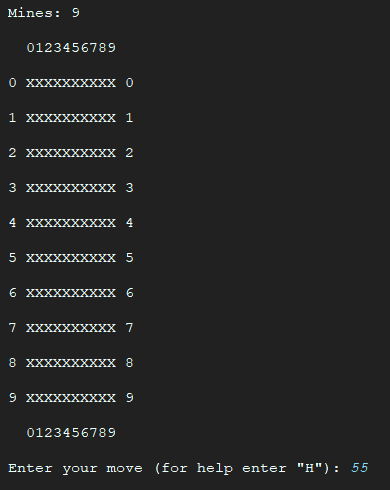

Here are a couple examples of how your output should look: 

After the first move "55", then the board looks like this:

.PNG)

A little further down the game, I have made some more moves, and I know a flag is at "36". If I want to place a flag there, it would look like this:

.PNG)

Notice the "F" at column 3, row 6. 

Here are some guiding questions to help get us start thinking about how to implement this game: 

- How do we use **object-oriented programming** to implement this game? 
- What are the **expected inputs** of this game? 
- What inputs are considered **invalid**?
- What **class(es)** are needed for this program? Think about what are the objects (in a literal sense) exist in the Minesweeper game. 

Remember that it is good practice to make our code as **modular** when possible!
